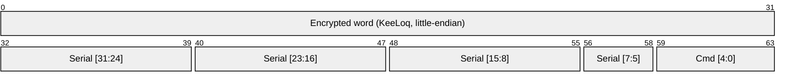
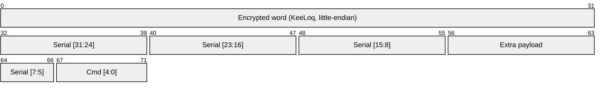
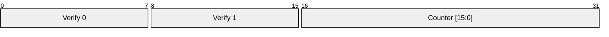

# The COSMO protocol

COSMO and COSMO | 2WAY are simple RF protocols working on the 868 Mhz band using FSK (frequency-shift keying) modulation. For security they use a simple rolling-code scheme and Keeloq symmetric encryption. On actual devices manufactured by Mobilus they are implemented using chips from the [Silabs EZRadio line](https://www.silabs.com/wireless/proprietary/ezradio-sub-ghz-ics).

The exact implementation is available in [cosmo.c](https://github.com/alufers/uni-gtw/blob/master/components/cosmo/cosmo.c)
 
## RF details

||COSMO| COSMO \| 2WAY|
|:-:|:-:|:-:|
|Frequency|**868.0 MHz**|**868.2 MHz**|
|Modulation|FSK (50 kHz deviation) |FSK (50 kHz deviation)|
|Preamble|Repeated `1010` pattern|Repeated `1010` pattern|
|Sync word|`2DD4`|`2DD4`|
|Data rate|2.4 kBaud|2.4 kBaud|
|Packet length|**8 bytes**|**9 bytes**|

## Packet structure

### Cosmo

### Cosmo | 2WAY

### Serial

Serial is a 21-bit value uniquely identifying the remote controller.

### Encrypted word plaintext

Before encryption the 32-bit plaintext word is laid out as follows (the same for both variants, except byte 0 which differs for 2-way):

| Bits | Field | Value |
|------|-------|-------|
| 31:24 | Verification byte 0 | `(serial[7:5] \| cmd) << 2` + popcount(extra\_payload) *(2-way only)* |
| 23:16 | Verification byte 1 | `((serial[7:5] \| cmd) >> 6) \| (serial[15:8] << 2)` |
| 15:0  | Rolling counter | 16-bit counter, incremented on every transmission |

### Command codes

The `cmd` field is 5 bits wide (values 0–31). Commands are sent from a controller to a blind; feedback codes are sent in the opposite direction. Please note that despite the name, some feedback is also sent by blinds using the older COSMO protocol (although less advanced).

| Code | Constant | Direction | Description |
|:---:|---|:---:|---|
| 0 | `COSMO_BTN_REQUEST_POSITION` | Command | If sent to a blind, it responds with the appropriate feedback command. |
| 1 | `COSMO_BTN_STOP` | Command | Stop movement |
| 2 | `COSMO_BTN_UP` | Command | Move up |
| 3 | `COSMO_BTN_UP_DOWN` | Command | Reverses motor direction if held. |
| 4 | `COSMO_BTN_DOWN` | Command | Move down |
| 5 | `COSMO_BTN_STOP_DOWN` | Command | Revers |
| 6 | `COSMO_BTN_STOP_HOLD` | Command |  Programs comfort position. |
| 7 | `COSMO_BTN_PROG` | Command | Pair as MASTER remote after factory reset, or enter/exit programming mode (if already paired).  |
| 8 | `COSMO_BTN_STOP_UP` | Command |  Pairs/unpairs secondary (non-master) remote. |
| 9 | `COSMO_BTN_FEEDBACK_OBSTRUCTION` | Feedback | Sent if the motor is overloaded. |
| 10 | `COSMO_BTN_FEEDBACK_BOTTOM` | Feedback | Sent if blinds are completely closed. |
| 11 | `COSMO_BTN_FEEDBACK_TOP` | Feedback | Sent if blinds are completely open. |
| 12 | `COSMO_BTN_FEEDBACK_COMFORT` | Feedback | Sent if blinds are at the comfort position. |
| 13 | `COSMO_BTN_FEEDBACK_PARTIAL` | Feedback | Sent if blinds are partially open/closed. Extra payload defines the percentage of open/closed. |
| 14 | `COSMO_BTN_FEEDBACK_IN_MOTION` | Feedback | Sent if blinds are in motion. |
| 16 | `COSMO_BTN_REQUEST_FEEDBACK` | Command | Request `COSMO_BTN_DETAILED_FEEDBACK` from the blinds. Extra payload defines what to ask for.  |
| 17 | `COSMO_BTN_TILT_INCREASE` | Command | Increase tilt angle. |
| 18 | `COSMO_BTN_TILT_DECREASE` | Command | Decrease tilt angle. |
| 19 | `COSMO_BTN_SET_POSITION` | Command | Set blinds to a specific position. Extra payload defines the target position. |
| 21 | `COSMO_BTN_DETAILED_FEEDBACK` | Feedback |  |
| 23 | `COSMO_BTN_SET_TILT` | Command | Set tilt angle to a specific value. Extra payload defines the target tilt angle. |

### `COSMO_BTN_REQUEST_FEEDBACK`

The extra payload defines what feedback to request. Here are the known values:

| Value | Description |
| --- | --- |
| 0 | Request device type 1. |
| 1 | Request device type 2. |
| 3 | Read tilt |

Device type 1 known values:
    - 1 - blinds with no tilt
    - 0x5 - C-SW
    - 9 - has tilt

Device type 2 known values:
    - 0x12  - C-MR BT
    - 0x0F - C-SW
